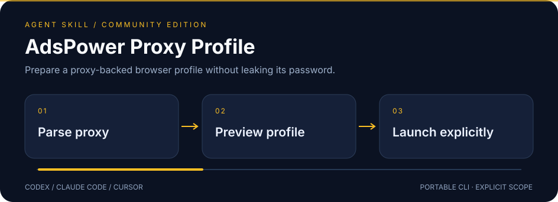

# AdsPower Proxy Profile

<p></p>

**Prepare a proxy-backed browser profile without leaking its password.**



A standalone skill for **Codex · Claude Code · Cursor**, backed by a portable Python CLI.
Independent community project; not affiliated with or endorsed by the provider.

## ✨ What it does

- Accept HTTP, HTTPS and SOCKS5 proxies with percent-encoded credentials from any provider.
- Constrain API calls to loopback and keep proxy passwords out of process arguments and output.
- Create and launch as separate deliberate steps; no automatic profile creation retries or silent browser launches.

## 🚀 Install

Requires Node.js **22.20+** for the tested skills installer.

```sh
npx skills@1.7.1 add joeeeeey/adspower-proxy-profile --agent codex claude-code cursor --yes
```

[View on skills.sh](https://skills.sh/joeeeeey/adspower-proxy-profile/adspower-proxy-profile)

Then ask your agent to use **adspower-proxy-profile**. The standard SKILL.md and bundled CLI are the
portable interface; no dependency on another personal skill is needed.

## 🔎 Try it

From the installed skill directory, or a repository checkout:

```sh
python3 scripts/adspower_profile.py status
python3 scripts/adspower_profile.py create --name demo-profile
python3 scripts/adspower_profile.py start PROFILE_ID
```

Python 3.10+ and the AdsPower desktop application running with Local API access. Set `ADSPOWER_PROXY_URL` or `ADSPOWER_PROXY_URL_FILE` using a secret manager/private file. If Local API authentication is enabled, set `ADSPOWER_API_KEY` or `_FILE`. API default: `http://127.0.0.1:50325`.

Run `python3 scripts/adspower_profile.py --help` for all commands.
Use a secret manager or a private local file for credentials; avoid pasting values into shell history.

## How to use it well

Check Local API availability. Build a profile preview from the user's proxy and target URL; `--execute` creates only the profile. Starting or stopping a browser separately requires authorization and `--execute` even though the provider uses GET for those actions. Never print browser debugging endpoints or session data. Use only accounts and workflows the user is authorized to operate.

## 🧪 Compatibility and verification

| Layer | Scope |
| --- | --- |
| Runtime | Python 3.10+; dependency-free standard library helpers |
| Agent interface | Standard SKILL.md + relative scripts; Codex, Claude Code, Cursor |
| Offline verification | Synthetic fixtures and mocks; run `python3 -m unittest discover -s tests -v` |
| Installation / native execution | See [validation evidence](references/validation.md) for exact tested levels |
| Live account operations | Not exercised as part of this release |

The illustration uses declarative SVG animation, with a readable static state and reduced-motion
fallback. It contains no JavaScript, external font or remote image dependencies.

## Limits and data handling

Requires a compatible AdsPower installation, subscription/API access and installed browser kernel. Does not buy proxies, test exit geolocation, automate logins, guarantee anonymity or bypass access controls. Default fingerprint settings are minimal; no forced macOS user agent.

Secret-like fields and configured credential values are redacted where supported. Ordinary
resource names, logs and account metadata may still be private: review output before sharing.

[Official documentation and API notes](references/api.md) · [MIT license](LICENSE)

## Provenance

Extracted and maintained from the author's existing local skill implementation, with
account-specific defaults and private operational notes removed. Documentation, fixtures and
workflow SVG artwork in this distribution are original. Provider marks are attributed in
[brand sources](assets/BRAND-SOURCES.md) and excluded from the MIT license. External runtimes and provider services retain
their own licenses and terms; this repository does not redistribute them.
